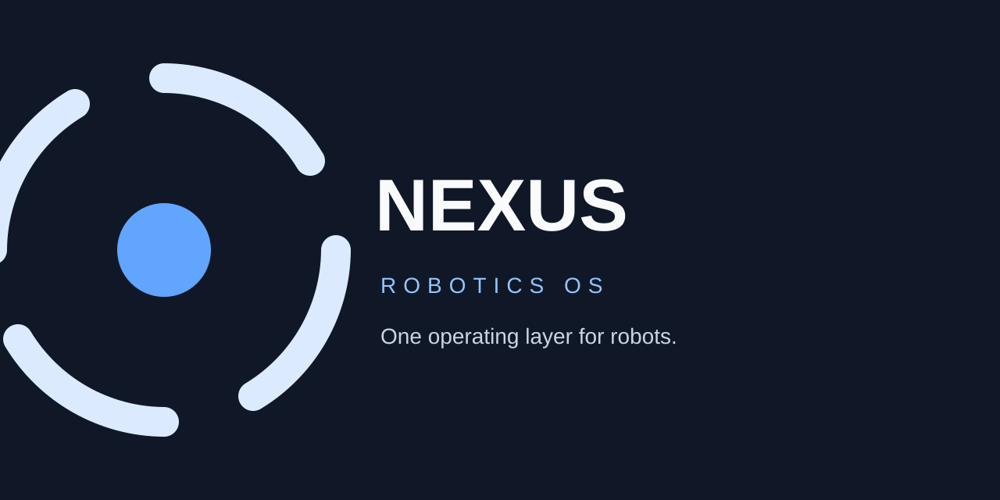
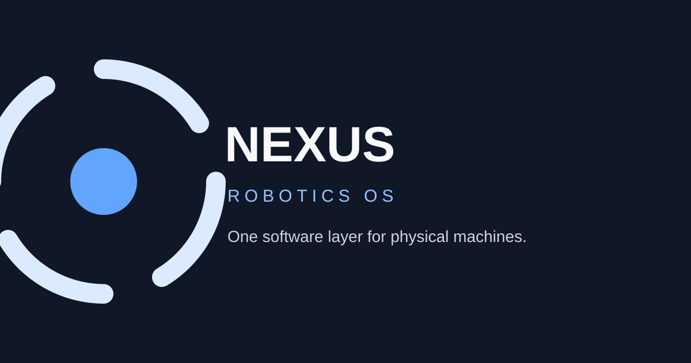
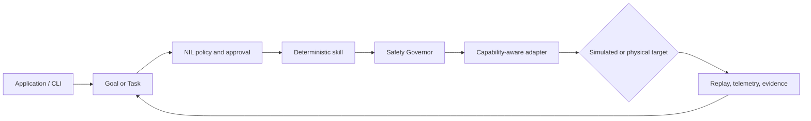
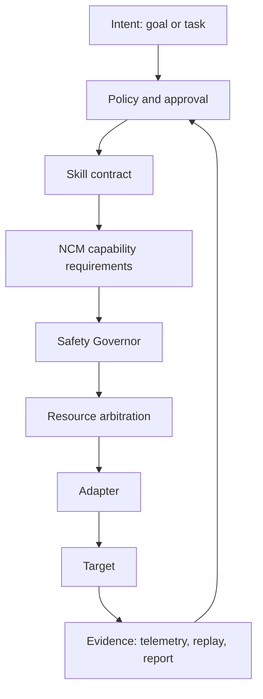

<p align="center">
  <a href="https://github.com/theworker02/Nexus-robotics-OS/releases/tag/v4.2.0-rc.1">
    
  </a>
</p>

<h1 align="center">Nexus Robotics OS</h1>

<p align="center"><strong>Make simple robots capable. Make capable robots yours.</strong></p>

<p align="center">
  <a href="https://github.com/theworker02/Nexus-robotics-OS/releases/tag/v4.2.0-rc.1"></a>
  <a href="LICENSE"></a>
  <a href="https://github.com/theworker02/Nexus-robotics-OS/actions"></a>
  <a href="docs/releases/4.2-validation.md"></a>
</p>

<p align="center">
  <a href="https://github.com/theworker02/Nexus-robotics-OS/releases">Releases</a> ·
  <a href="https://magnexis.github.io/nexus-robotics">Website</a> ·
  <a href="docs/">Documentation</a> ·
  <a href="CONTRIBUTING.md">Contribute</a>
</p>

> **Nexus is a Rust-first, capability-driven robotics platform for simulation, skills, safety, learning, and heterogeneous hardware integration.**

Nexus gives applications one stable operating model while preserving the stack already in place: a simulator, ROS 2 graph, LeRobot workflow, vendor SDK, or custom adapter. Skills declare capabilities instead of robot brands. Safety remains deterministic. Evidence labels distinguish software checks from simulation, HIL, vendor, and physical-robot validation.

**Current channel:** `4.2.0-rc.1` — public release candidate. This release is local- and simulation-first. It does not claim universal hardware support, live ROS 2 transport, external model-provider access, live MCP/device transport, vendor certification, HIL, or production autonomy.

## Contents

- [A visual tour](#a-visual-tour)
- [Why Nexus](#why-nexus)
- [What ships in 4.2](#what-ships-in-42)
- [Quick start](#quick-start)
- [Run the simulator](#run-the-simulator)
- [Use the CLI](#use-the-cli)
- [Build and test](#build-and-test)
- [Docker workflow](#docker-workflow)
- [Install published crates](#install-published-crates)
- [Architecture](#architecture)
- [Safety and evidence](#safety-and-evidence)
- [Integration status](#integration-status)
- [Repository map](#repository-map)
- [Documentation](#documentation)
- [Contributing](#contributing)

## A visual tour

<p align="center">
  
</p>

The repository currently ships branded SVG presentation assets rather than recorded robot footage. The examples below are deterministic terminal workflows and Mermaid diagrams, so they can be replayed locally without implying that a screenshot, GIF, HIL run, or physical robot demonstration exists.

```text
┌──────────────────────────────────────────────────────────────────────┐
│  NEXUS CLI  →  GOAL / TASK  →  POLICY + APPROVAL  →  SKILL           │
│       ↓             ↓                 ↓                 ↓             │
│  PROFILE       CAPABILITIES       SAFETY         REPLAY + TELEMETRY   │
│       └────────────────────── NXR-2 SIMULATOR ──────────────────────┘ │
└──────────────────────────────────────────────────────────────────────┘
```



## Why Nexus

Robotics software is fragmented by mechanical design, middleware, simulator, training workflow, and vendor SDK. Nexus sits between those systems:

```text
Applications · Studio · Web Console · CLI
                     │
              Nexus Runtime
                     │
  Skills · Tasks · Safety · Identity · Telemetry · Replay
                     │
          Nexus Capability Model (NCM)
                     │
 ROS 2 · LeRobot · Nori layer · Custom HAL · Simulator
                     │
              Simulated or physical robot
```

The platform does not replace a vendor’s low-level controller. It makes compatible systems discoverable, observable, testable, and safer to program through shared contracts.

## What ships in 4.2

- **Nexus Brain:** hardware manifests, capability profiling, NCI scoring, N0–N4 recommendations, feature resolution, memory budgets, and workload guidance.
- **Deterministic runtime:** skills, tasks, permissions, safety preconditions, resource locks, watchdogs, cancellation, recovery, telemetry, and replay records.
- **NCM 2.5:** versioned capability resources with properties, quality thresholds, alternatives, and provenance.
- **NXR simulation:** deterministic NXR-1/NXR-2 robots, VirtualBus, virtual servos, fault injection, warehouse-fetch scenarios, and structured events.
- **Proving Ground:** L0–L5 evidence labels, virtual hardware checks, seeded scenarios, and reproducible reports.
- **Integration foundations:** ROS 2 capability mapping, LeRobot episode contracts, Nori community compatibility surfaces, and an adapter SDK.
- **Gateway and fleet primitives:** `nexusd`, local connection state, conservative telemetry buffering, and capability-aware scheduling.
- **Developer surface:** Rust SDK, CLI, package metadata, examples, specifications, website, CI, and release documentation.

The built-in skills cover motion, manipulation, perception, interaction, and system behavior. They are currently simulation-validated; that label must not be upgraded to HIL or physical validation without new evidence.

## Quick start

### Requirements

- Rust stable with Cargo: [rustup.rs](https://rustup.rs/)
- Git
- Optional: Docker Desktop with its Linux engine enabled
- Optional: Node.js if you want to work on [`website/`](website/)

Clone the repository and enter it:

```powershell
git clone https://github.com/theworker02/Nexus-robotics-OS.git
cd Nexus-robotics-OS
```

On macOS/Linux, the same workflow is:

```bash
git clone https://github.com/theworker02/Nexus-robotics-OS.git
cd Nexus-robotics-OS
```

### First run

```powershell
cargo test --workspace
cargo run -p nexus-cli-1 -- doctor
cargo run -p nexus-cli-1 -- sim robot nxr-2
```

The first build downloads Rust dependencies and compiles the workspace. No robot, cloud account, language model, or external provider is required for the deterministic simulator path.

## Run the simulator

The canonical NXR-2 warehouse flow finds a blue container, performs a simulated pickup, delivers it to Station B, and emits replayable events:

```powershell
cargo run -p nexus-cli-1 -- sim robot nxr-2
cargo run -p nexus-cli-1 -- task run fetch-object --no-ai
cargo run -p nexus-cli-1 -- goal plan Find the blue container and bring it here --no-ai
cargo run -p nexus-cli-1 -- goal run Find the blue container and bring it here --approve --no-ai
cargo run -p nexus-cli-1 -- bench simple-robot --no-ai
```

Inspect the robot profile and deterministic capabilities:

```powershell
cargo run -p nexus-cli-1 -- profile
cargo run -p nexus-cli-1 -- compatibility inspect nori-a3
cargo run -p nexus-cli-1 -- skill list
cargo run -p nexus-cli-1 -- telemetry
```

Exercise constrained hardware planning without touching a physical actuator:

```powershell
cargo run -p nexus-cli-1 -- emulate hardware --ram 1024 --cpu 2 --camera 1 --motors 2
cargo run -p nexus-cli-1 -- hardware validate examples/hardware/minimum-robot.nexus.toml
cargo run -p nexus-cli-1 -- brain status
cargo run -p nexus-cli-1 -- model recommend
cargo run -p nexus-cli-1 -- upgrade advisor --budget 50
```

## Use the CLI

Preview before execution whenever possible. `--dry-run` and `--no-ai` keep examples deterministic and local:

```powershell
# Inspect the available commands
cargo run -p nexus-cli-1 -- --help
cargo run -p nexus-cli-1 -- task --help

# Preview a capability-driven task
cargo run -p nexus-cli-1 -- task run fetch-object --dry-run --no-ai

# Review the autonomy envelope and profile
cargo run -p nexus-cli-1 -- autonomy envelope --no-ai
cargo run -p nexus-cli-1 -- autonomy profile autonomous --no-ai

# Produce virtual certification evidence
cargo run -p nexus-cli-1 -- prove skill fetch-object --trials 100 --seed 483208
cargo run -p nexus-cli-1 -- prove all --trials 100

# Inspect an NRP package and launch the local gateway foundation
cargo run -p nexus-cli-1 -- package inspect examples/packages/nexus-nori.yaml
cargo run -p nexusd-1
```

### Rust library usage

The workspace exposes focused crates for applications and adapter authors:

| Crate | Role |
| --- | --- |
| `nexus-core-1` | Core capability, safety, and robot-domain contracts |
| `nexus-protocol-1` | Protocol-neutral virtual hardware and device contracts |
| `nexus-brain` | Hardware-aware intelligence profiling and planning |
| `nexus-runtime` | Skills, safety, simulation, learning, and runtime orchestration |
| `nexus-gateway` | Local safety-preserving gateway state machine |
| `nexus-fleet` | Capability-aware fleet scheduling |
| `nexus-integration-sdk` | Adapter and integration authoring contracts |

`nexus-core-1` is the crates.io package name chosen to avoid a collision with an unrelated existing `nexus-core` crate. Existing Rust imports remain ergonomic through the dependency alias:

```toml
[dependencies]
nexus-core = { package = "nexus-core-1", version = "4.2.0-rc.1" }
```

```rust
use nexus_core::{Capability, CapabilityManifest, Health};
```

## Build and test

Run the full workspace checks before opening a pull request:

```powershell
cargo fmt --all -- --check
cargo check --workspace
cargo test --workspace
cargo package --workspace --allow-dirty
```

To focus on one package:

```powershell
cargo test -p nexus-runtime
cargo test -p nexus-ros2-adapter
cargo package -p nexus-core-1 --allow-dirty
```

Generated Rust output belongs in `target/` and is intentionally excluded from commits. Release artifacts must be produced from a clean, reviewed commit whenever possible.

## Docker workflow

The development compose file runs the local simulator in a hardened software-only environment:

```powershell
docker compose -f compose.dev.yml build

docker compose -f compose.dev.yml run --rm nexus-simulator
```

Docker Desktop’s Linux engine must be running. This workflow validates software and simulation behavior; it does not establish HIL, vendor, or physical-robot evidence.

## Install published crates

The 4.2.0-rc.1 package set is published in dependency order when registry ownership and credentials permit. The renamed core package is:

```powershell
cargo add nexus-core-1@4.2.0-rc.1
```

For a direct dependency without `cargo-edit`:

```toml
[dependencies]
nexus-core = { package = "nexus-core-1", version = "4.2.0-rc.1" }
nexus-runtime = "4.2.0-rc.1"
```

Registry publication is separate from GitHub release publication. Always verify the package page and version on [crates.io](https://crates.io/) before depending on a release candidate.

## Architecture

Nexus uses capability contracts as the seam between intent and hardware:



A physical command is never a direct language-model output:

```text
Goal / Task → policy and approval → Skill → action proposal
          → Safety policy → resource arbitration → Adapter → Robot
```

Nexus combines applicable limits conservatively. Vendor limits may tighten a Nexus motion policy, but Nexus never relaxes vendor-declared limits automatically. Persistent motion is not automatically resumed after restart; operator review is required.

## Safety and evidence

Models propose. Nexus validates. No language model receives raw actuator authority. Physical execution requires a compatible adapter, configured limits, emergency-stop controls, and hardware-specific validation.

| Level | Evidence label | What is required |
| --- | --- | --- |
| L0 | Software Verified | Runtime, schema, state-machine, and contract tests |
| L1 | Virtual Hardware Verified | VirtualRobotBus device and fault behavior |
| L2 | Physics Verified | Gazebo Harmonic execution evidence |
| L3 | Adversarial Simulation Verified | Physics plus seeded faults and randomized worlds |
| L4 | HIL Verified | Real controller or sensor evidence |
| L5 | Physical Robot Verified | Physical robot demonstration and review |

Simulation, Docker, VirtualBus, and software tests do not establish HIL or physical-robot validation. The release documentation records unavailable external evidence as `NOT RUN` rather than silently promoting it.

## Integration status

| Integration | Current surface | Evidence boundary |
| --- | --- | --- |
| NXR-2 | Deterministic simulator and profile | Local simulation |
| Nori community | Compatibility profile and adapter contracts | Simulated; no vendor endorsement or physical validation |
| ROS 2 | Common message/action capability mapper | Live graph transport is not validated in this release |
| LeRobot | Episode and dataset metadata bridge | Fixture/contract surface; adapter-dependent |
| Custom hardware | Integration SDK and capability model | Requires adapter, safety review, and external validation |

The ROS 2 surface is a contract mapper, not a live certified ROS graph bridge. Nexus does not claim partnership, certification, or vendor support for Nori or any other hardware vendor.

## Repository map

```text
crates/          Core, runtime, protocol, gateway, brain, and fleet libraries
apps/            CLI (`nexus`) and local gateway (`nexusd`)
integrations/    Nori community, LeRobot, and ROS 2 adapter surfaces
sdk/             Rust and integration SDKs
examples/        Robot, scenario, hardware, and package examples
skills/          Built-in skill manifests and documentation
specifications/  Versioned contracts and design specifications
docs/            Product, integration, simulation, safety, and release docs
website/         Product website source
proving-ground/  Scenarios, worlds, bridge configuration, and reports
assets/          Official Nexus brand assets
```

## Documentation

- [Architecture](ARCHITECTURE.md)
- [Product values](docs/product/VALUES.md)
- [Compatibility matrix](COMPATIBILITY.md)
- [NCM 2.5 specification](specifications/NCM-2.5.md)
- [Reliable skills](docs/skills/reliable-skills.md)
- [Simulation guide](docs/simulation/warehouse-fetch.md)
- [Proving Ground](docs/proving-ground.md)
- [Safety and hardware validation](docs/hardware-validation.md)
- [ROS 2 compatibility](docs/integrations/ros2.md)
- [Nori compatibility](docs/integrations/nori.md)
- [4.2.0-rc.1 release notes](docs/releases/v4.2.0-rc.1.md)
- [4.2 validation report](docs/releases/4.2-validation.md)
- [External validation plan](docs/releases/4.2-external-validation.md)
- [Changelog](CHANGELOG.md)
- [Roadmap](ROADMAP.md)
- [Rust API documentation](https://docs.rs/nexus-runtime)
- [GitHub prereleases](https://github.com/theworker02/Nexus-robotics-OS/releases)
- [Nexus website](https://magnexis.github.io/nexus-robotics)

## Roadmap

The current release establishes reliable local execution contracts and multi-stack integration foundations. Next milestones include expanded HIL coverage, real transport implementations, cryptographic package signing, a package registry, robot-image tooling, and multi-robot orchestration.

See [ROADMAP.md](ROADMAP.md) for the current plan.

## Contributing

Contributions are especially useful in these areas:

- capability profiles and adapter conformance tests;
- deterministic simulation scenarios and reliable skill evidence;
- ROS 2, LeRobot, and community integration contracts;
- documentation, examples, and developer tooling.

Please read [CONTRIBUTING.md](CONTRIBUTING.md), [CODE_OF_CONDUCT.md](CODE_OF_CONDUCT.md), [GOVERNANCE.md](GOVERNANCE.md), and [SECURITY.md](SECURITY.md) before contributing. For security-sensitive issues, follow the [security policy](SECURITY.md) instead of opening a public issue.

## Citation, funding, and license

If you use Nexus in research, cite the version described in [CITATION.cff](CITATION.cff). Development can be supported through [GitHub Sponsors](https://github.com/sponsors/theworker02); see [FUNDING.md](FUNDING.md).

Nexus Robotics OS is licensed under [Apache-2.0](LICENSE).
