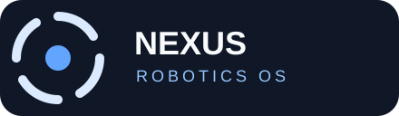

<p align="center">
  
</p>

<h1 align="center">Nexus Robotics OS</h1>

<p align="center"><strong>Make simple robots capable. Make capable robots yours.</strong></p>

<p align="center">
  <a href="LICENSE"></a>
  <a href="CHANGELOG.md"></a>
  <a href="SECURITY.md"></a>
  <a href="docs/hardware-validation.md"></a>
</p>

Nexus Robotics OS is a Rust-first, hardware-agnostic robotics platform for skills, configurable intelligence, learning, simulation, safety, connected tools, and heterogeneous robotic hardware. It gives applications and robot skills one stable, capability-driven interface while preserving the robotics stack already in place: simulator, ROS 2 graph, LeRobot workflow, vendor software, or custom hardware adapter.

> **Give simple robots capabilities far beyond their hardware.**

Version 3.5 adds **Nexus Brain**, an adaptive hardware-intelligence layer. It profiles confirmed robot hardware, calculates a transparent Nexus Capability Index (NCI), derives feature levels and a memory budget, and recommends what should remain local, what may be delegated to a future approved Brain host, and what must stay disabled. NIL remains the policy-governed layer above skills and Safety Governor for inspectable goal plans and approval.

Nexus does not promise that one binary runs on every robot. It provides the contracts, safety boundary, simulation tools, and integration model required to make heterogeneous robots interoperable when an adapter and capability profile exist.

> Write behaviors against capabilities—not robot brands.

## Why Nexus

Robotics software is fragmented by mechanical design, middleware, simulator, training workflow, and vendor SDK. Rebuilding an application or behavior for each stack is expensive and makes safety, replay, and validation inconsistent.

Nexus sits between applications and those stacks:

```text
Applications, Studio, Web Console, CLI
                 │
         Nexus Runtime
                 │
Skills · Tasks · Safety · Identity · Telemetry · Replay
                 │
    Nexus Capability Model (NCM)
                 │
ROS 2 · LeRobot · Nori community layer · Custom HAL · Simulator
                 │
       Physical or simulated robot
```

The platform’s job is not to replace a vendor’s low-level system. Its job is to make compatible systems discoverable, observable, testable, and safer to program through a shared operating model.

## Flagship features

### SenseHopping

> Dynamically route information requirements across healthy available robot sensors, then fuse compatible modalities when it improves the estimate.

Skills request information such as obstacle distance or door geometry rather than hard-coding a sensor model. The router records primary selection, fallback, confidence, and reason in replay evidence.

### StructureScan

> Build a versioned understanding of visible and instrument-accessible walls, doors, openings, surfaces, and structural changes.

StructureScan includes DoorScan, material estimates with uncertainty, and StructureDiff. It explicitly excludes through-wall person detection and covert surveillance workflows.

### Active Learning

> Run controlled simulation-first learning sessions where failed tasks produce bounded, measurable, auditable improvement proposals.

Active Learning may optimize safe parameters but can never weaken Safety Governor limits or silently promote a learned behavior to production.

### Nexus Proving Ground

> Earn repeatable evidence before actuator access—not merely a successful compile.

Proving Ground combines L0 software checks, L1 adapter-facing virtual hardware, seeded WorldForge scenarios, adversarial fault injection, replayable reports, and a future Gazebo/ROS physics backend. It reports every unearned level explicitly as `NOT RUN`.

## What v3.5 includes

- **Adaptive Intelligence Runtime**: the `nexus-brain` Rust crate, hardware manifests, capability profiling, NCI scoring, N0-N4 recommendations, feature resolution, MemCore memory budgets, pressure responses, local/edge workload planning, model-fit guidance, and cost-bounded upgrade advice.
- **Hardware-aware CLI**: inspect host compute, validate `robot.nexus.toml`, emulate constrained hardware, inspect a Brain plan, recommend model placement, advise upgrades, and produce a C1 emulated minimum-robot profile result.
- **Adaptive autonomy foundation**: NIL intelligence profiles, granular capability grants and permission decisions, explainable goal plans, approval gates, operating-envelope reporting, local experience memory, automation/routine domain models, and a privacy-aware compute router.
- **Goal-first CLI**: preview and run policy-governed goals with `nexus goal`, inspect an autonomy envelope with `nexus autonomy`, and run the deterministic `nexus bench simple-robot` reference benchmark.
- **NCM 2.5** semantic capability resources with versions, properties, quality thresholds, alternatives, and provenance.
- **Reliable skills**: 35 built-in, simulation-validated skill contracts spanning motion, manipulation, perception, interaction, and system behavior.
- **Safety infrastructure**: capability checks, preconditions, speed/joint limits, emergency stop, effective vendor limits, exclusive resource locks, watchdogs, and no-auto-resume recovery.
- **Simulation and replay**: NXR-1, NXR-2, deterministic scenarios, VirtualBus, virtual servos, fault injection, structured events, telemetry, and replay records.
- **Proving Ground**: validation levels L0–L5, VirtualRobotBus device faults, seeded WorldForge trials, certification reports, and a Gazebo Harmonic/ROS 2 bridge scaffold.
- **Integration foundations**: Nori community profile, Nori-Lab session boundary, MotorLab-style diagnostics, LeRobot episode bridge, ROS 2 capability mapper, and integration SDK.
- **Deployment primitives**: local gateway state machine, `nexusd`, capability-aware fleet scheduler, NRP package metadata, containerized simulator configuration, and CI checks.
- **Developer experience**: Rust SDK, integration SDK, CLI, specifications, examples, product website, branding system, and public project documentation.

## Quick start

### Run the canonical simulator demo

```powershell
cargo test --workspace
cargo run -p nexus-cli -- sim robot nxr-2
cargo run -p nexus-cli -- task run fetch-object --no-ai
cargo run -p nexus-cli -- goal plan Find the blue container and bring it here --no-ai
cargo run -p nexus-cli -- goal run Find the blue container and bring it here --approve --no-ai
cargo run -p nexus-cli -- bench simple-robot --no-ai
cargo run -p nexus-cli -- emulate hardware --ram 1024 --cpu 2 --camera 1 --motors 2
cargo run -p nexus-cli -- hardware validate examples/hardware/minimum-robot.nexus.toml
```

The deterministic NXR-2 warehouse demo finds a blue container, performs a simulated pickup, delivers it to Station B, and creates replay events. It runs locally with no robot, account, cloud service, or language model.

### Inspect a compatibility target

```powershell
cargo run -p nexus-cli -- compatibility inspect nori-a3
cargo run -p nexus-cli -- task run fetch-object --dry-run --no-ai
cargo run -p nexusd
```

### Run the containerized simulator

```powershell
docker compose -f compose.dev.yml run --rm nexus-simulator
```

The compose configuration is security-hardened for local software and simulation checks. Docker Desktop’s Linux engine must be running before the image can be built or executed.

## Platform values

| Value | What it means in Nexus |
| --- | --- |
| Interoperability | A capability layer spans heterogeneous robots and robotics stacks. |
| Safety | Nexus-originated physical commands pass through policy and safety enforcement. |
| Portability | Skills declare requirements rather than assume a vendor or model. |
| Reproducibility | Simulation, replay, manifests, packages, containers, and CI make behavior inspectable. |
| Observability | Commands, tasks, skills, state changes, and safety decisions leave evidence. |
| Progressive validation | Unit-tested, simulation-tested, HIL-tested, hardware-validated, and vendor-validated are distinct labels. |

Read the complete [platform values](docs/product/VALUES.md).

## Reliable skills

Nexus v3.5 treats a skill as a behavior package with an explicit operating contract—not a function that simply emits actuator commands.

Every built-in skill carries:

- capability and permission requirements;
- readiness, health, battery, and safety preconditions;
- exclusive physical-resource requirements, such as `base` or `right_arm`;
- maximum runtime, cancellation policy, recovery metadata, and validation lifecycle;
- deterministic execution metadata and structured replay events.

The runtime validates capability compatibility, preconditions, and resource ownership before execution. Emergency stop overrides every skill cancellation policy.

| Area | Built-in skills |
| --- | --- |
| Motion | `stop`, `pause`, `resume`, `move_forward`, `move_backward`, `rotate`, `walk_to`, `navigate_to`, `return_home`, `dock` |
| Manipulation | `open_gripper`, `close_gripper`, `reach`, `pick_up`, `place`, `place_object`, `handoff`, `stow_arm` |
| Perception | `look_at`, `scan_room`, `scan_area`, `find_object`, `inspect_object`, `track_object`, `follow_target` |
| Interaction | `speak`, `listen_for_command`, `request_assistance` |
| System | `self_check`, `recalibrate`, `safe_shutdown` |

The current skill set is **simulation-validated**. It must not be represented as HIL-tested or physical-hardware-validated. See [Reliable skills](docs/skills/reliable-skills.md) and the [Skill Reliability specification](specifications/SKILL-RELIABILITY-1.0.md).

## Capability model

Nexus Capability Model (NCM) describes what a robot can do and where that claim came from. NCM 2.5 also supports structured constraints, so a skill can ask for more than a boolean capability.

```yaml
capability:
  id: manipulation.arm.right
  version: 1
  available: true
properties:
  dof: 7
  payload_kg: 1.5
  gripper: parallel
quality: {}
source:
  type: adapter
  integration: nori-community
```

A skill can then require, for example, a manipulator with at least six degrees of freedom or depth sensing with a minimum useful range. Nexus rejects a compatibility claim when its constraints cannot be demonstrated by the capability record.

Read [NCM 2.5](specifications/NCM-2.5.md) and [NCM 2.0](specifications/NCM-2.0.md).

## Safety and validation

Models propose. Nexus validates. The Safety Governor remains deterministic, and no language model receives raw actuator authority. Physical execution still requires compatible adapters, configured limits, emergency-stop controls, and hardware-specific validation.

Validation levels are evidence labels, not marketing claims:

- **L0** Software Verified
- **L1** Virtual Hardware Verified
- **L2** Physics Verified
- **L3** Adversarial Simulation Verified
- **L4** Hardware-in-the-Loop Verified
- **L5** Physical Robot Verified

Simulation, VirtualBus, Docker, and software checks do not establish HIL or physical-robot validation.

## Adaptive autonomy

NIL does not bypass the runtime's existing safety boundary. It compiles a narrow set of deterministic reference objectives into transparent skill steps, checks the configured intelligence profile, and asks for approval before supervised operations or gated permissions. A profile can grant, require approval for, or prohibit navigation, perception, exploration, manipulation, object movement, door operations, and leaving the allowed zone.

```powershell
cargo run -p nexus-cli -- autonomy envelope --no-ai
cargo run -p nexus-cli -- autonomy profile autonomous --no-ai
cargo run -p nexus-cli -- goal plan Explore the permitted workspace and inspect it --no-ai
```

The current implementation is intentionally local and simulation-first. It includes an in-memory local experience store with category-level retention policy (operator memory is disabled by default) and a compute-placement policy that keeps private work local. Voice control, remote teleoperation, mobile control surfaces, persistent user profiles, cloud execution, and direct physical-autonomy activation are not implemented by this release.

Read [Adaptive autonomy](docs/autonomy.md), [memory and privacy](docs/memory.md), and [automation and routines](docs/automation.md).

## Nexus Brain and hardware profiles

Nexus Brain scales platform features from a confirmed hardware profile rather than treating a hardware class as a permanent entitlement. `N0` through `N4` are recommendations, never a scientific measurement or a lock-in. Feature availability remains capability-based: an RGB camera can enable Basic StructureScan; depth enables Enhanced; depth plus lidar enables Advanced.

```powershell
cargo run -p nexus-cli -- profile
cargo run -p nexus-cli -- hardware validate examples/hardware/minimum-robot.nexus.toml
cargo run -p nexus-cli -- emulate hardware --ram 1024 --cpu 2 --camera 1 --motors 2
cargo run -p nexus-cli -- brain status
cargo run -p nexus-cli -- model recommend
cargo run -p nexus-cli -- upgrade advisor --budget 50
cargo run -p nexus-cli -- prove profile cheap-mobile-robot
```

The profiler's automatic mode only detects the local host CPU architecture and logical CPU count; it clearly labels the rest as a conservative profile until an operator confirms or imports a manifest. `robot.nexus.toml` parsing and validation are implemented, but hardware probing, calibration, a GUI wizard, persistent memory, Brain discovery/pairing, encrypted synchronization, model loading, and remote execution are not yet implemented. `nexus brain serve` therefore refuses to bind a network port until an authenticated encrypted transport exists.

See [Nexus Brain](docs/nexus-brain.md), the [hardware manifest reference](docs/hardware-profiles.md), and [Nexus Brain 1.0](specifications/NEXUS-BRAIN-1.0.md).

The physical command boundary is deliberate:

```text
Goal / Task → NIL policy and approval → Skill → Action proposal → Safety policy → Resource arbitration → Adapter → Robot
```

Nexus combines applicable limits conservatively. Vendor limits may tighten a Nexus motion policy, but Nexus never relaxes vendor-declared limits automatically. Watchdogs detect stale command, adapter, telemetry, runtime, and skill heartbeats. Persistent motion is never automatically resumed after a restart; operator review is required.

**Important:** simulation, VirtualBus, Docker, and software safety checks do not replace manufacturer safety limits, hardware emergency stops, mechanical guarding, operator training, or physical validation.

See [Safety 1.0](specifications/SAFETY-1.0.md), [Gateway 1.0](specifications/GATEWAY-1.0.md), [runtime recovery](docs/recovery.md), and [hardware validation](docs/hardware-validation.md).

## Simulation and VirtualBus

NXR-1 and NXR-2 are deterministic reference robots for testable local workflows. NXR-2 models a mobile manipulator with dual arms, grippers, RGB/depth cameras, lidar, IMU, battery, audio, and a virtual servo bus.

VirtualBus allows adapter and driver behavior to be exercised without hardware. It models virtual servo position, velocity, temperature, current, voltage, limits, connection state, and faults such as overtemperature, timeout, bus disconnect, and position failure.

```powershell
cargo run -p nexus-cli -- sim scenario warehouse-fetch --no-ai
cargo run -p nexus-cli -- sim fault camera
```

Simulation is an evidence-producing development environment, not a physical validation claim. Read [Warehouse fetch](docs/simulation/warehouse-fetch.md).

## Virtual certification

Nexus Proving Ground makes each validation claim factual and reproducible.

| Level | Meaning | Current local executor |
| --- | --- | --- |
| L0 | Software Verified | Runtime, schema, state-machine, and contract tests |
| L1 | Virtual Hardware Verified | VirtualRobotBus device and fault behavior |
| L2 | Physics Verified | Gazebo Harmonic execution evidence required |
| L3 | Adversarially Verified | L2 plus seeded faults and randomized worlds required |
| L4 | HIL Verified | Real controller or sensor evidence required |
| L5 | Robot Verified | Physical robot demonstration required |

```powershell
cargo run -p nexus-cli -- prove skill fetch-object --trials 100 --seed 483208
cargo run -p nexus-cli -- prove all --trials 100
cargo run -p nexus-cli -- prove skill door-scan --output proving-ground/reports/door-scan.md
```

The local skill runner earns only the evidence it actually executes. The recorded `move_forward@2.6.0` assertion has L2 Gazebo evidence through the NXR-2 model and live ROS/Gazebo transport; the other skills remain L1 until their own physics assertions run. L3 additionally requires repeated, randomized physics trials with fault assertions. The v3.5 hardware profile check is C1 emulation only, while the Simple Robot Test is a deterministic local benchmark; neither is physics, HIL, or physical-robot certification. See [Proving Ground](docs/proving-ground.md), the [move-forward L2 certification](proving-ground/reports/move-forward-nxr2-physics-2026-08-26.md), the [recorded backend smoke](proving-ground/reports/gazebo-harmonic-backend-smoke-2026-08-26.md), and [Proving Ground 1.0](specifications/PROVING-GROUND-1.0.md).

## Integrations

Integration status is factual and intentionally conservative.

| Integration | Discovery | Telemetry | Skills | Simulation | Hardware status |
| --- | --- | --- | --- | --- | --- |
| NXR-2 | Deterministic profile | Local runtime | Built-in contracts | Yes | Not applicable |
| Nori community | Simulated public profile | Simulated adapter | Compatibility checked | Yes | Unverified |
| ROS 2 | Common message/action mapper | Contract surface | Capability mapping | Contract-tested | Live graph transport unvalidated |
| LeRobot | Episode/data contracts | Dataset metadata | Bridge foundation | Fixture-tested | Varies by adapter |
| Custom hardware | Integration SDK | Adapter-defined | Capability-driven | VirtualBus | Requires adapter and validation |

### Nori Robotics reference integration

**First-class community integration target: Nori Robotics.** Nexus includes a community-built compatibility layer targeting publicly documented Nori-style capabilities and workflows. It connects a Nori-style profile, Nori-Lab session interface, LeRobot-compatible data concepts, MotorLab-style read-only diagnostics, simulation, and Nexus skills through the common runtime.

Nexus does not modify upstream Nori repositories and does not claim partnership, certification, vendor support, or physical Nori validation. The profile encodes only documented or explicitly configured capabilities.

```powershell
cargo run -p nexus-cli -- sim robot nori-a3
cargo run -p nexus-cli -- compatibility inspect nori-a3
```

Read [Nori compatibility](docs/integrations/nori.md).

### ROS 2

The ROS 2 adapter maps common image, camera-info, IMU, battery, lidar, point-cloud, velocity-command, and joint-trajectory interfaces into discovered capabilities. It is a capability mapper and adapter contract at this release; it is not yet a live certified ROS graph bridge.

Read [ROS 2 compatibility](docs/integrations/ros2.md).

### LeRobot

The LeRobot bridge retains episode timestamps, observations, action vectors, camera references, and metadata while reporting any lossy conversion conditions. Nexus is designed to make LeRobot workflows accessible through a shared runtime—not to replace training infrastructure.

## Gateway, fleet, and packages

`nexusd` is the local gateway foundation. It models the robot-side connection state machine, preserves local emergency control, buffers telemetry, and denies unsafe new operations when a central connection disappears.

Fleet scheduling selects from registered robots using requirements, healthy state, battery threshold, group, connection state, and workload. It deliberately does not perform personal tracking.

Nexus Robotics Packages (NRP) provide typed package metadata for skills, adapters, profiles, simulators, models, and integrations. Unsigned packages are visibly local-development-only; production mode must reject them.

```powershell
cargo run -p nexus-cli -- package inspect examples/packages/nexus-nori.yaml
cargo run -p nexusd
```

Read [NRP 1.0](specifications/NRP-1.0.md), [Integration 1.0](specifications/INTEGRATION-1.0.md), and [Fleet scheduling](docs/fleet.md).

## Developer surface

| Surface | Purpose |
| --- | --- |
| `nexus` | Local CLI for simulation, tasks, skills, compatibility, packages, diagnostics, and telemetry. |
| `nexusd` | Local robot gateway state-machine foundation. |
| Rust SDK | Native local runtime access through `sim://nxr-1`. |
| Integration SDK | Conservative adapter package scaffolding with no implicit actuator permissions. |
| Website | Interactive product and NXR-2 capability overview in [`website/`](website/). |

Useful commands:

```powershell
cargo run -p nexus-cli -- doctor
cargo run -p nexus-cli -- skill list
cargo run -p nexus-cli -- task run fetch-object --dry-run --no-ai
cargo run -p nexus-cli -- telemetry
```

## Repository guide

```text
crates/          Core, runtime, protocol, gateway, and fleet libraries
integrations/    Nori community, LeRobot, and ROS 2 adapter surfaces
skills/          Built-in skill manifests and package documentation
sdk/             Rust and integration SDKs
apps/            CLI and nexusd gateway executable
examples/        Robot, scenario, and package examples
specifications/  Versioned contracts
docs/            Product, architecture, integration, simulation, and safety documentation
website/         Nexus product website
docker/          Reproducible container build documentation
proving-ground/  Certification scenarios, worlds, bridge configuration, and reports
```

## Documentation

- [Architecture](ARCHITECTURE.md)
- [Product values](docs/product/VALUES.md)
- [Specifications](specifications/)
- [Simulation](docs/simulation/warehouse-fetch.md)
- [Proving Ground](docs/proving-ground.md)
- [Safety and validation](docs/hardware-validation.md)
- [Contributing](CONTRIBUTING.md)
- [Security policy](SECURITY.md)
- [Support](SUPPORT.md)

## Roadmap

The current release establishes reliable local execution contracts and multi-stack integration foundations. The next milestones are expanded hardware-in-the-loop coverage, real transport implementations, cryptographic package signing, the package registry, robot-image tooling, and multi-robot orchestration.

See [ROADMAP.md](ROADMAP.md) for the current plan.

## Citation

If you use Nexus in research, cite the released version described in [CITATION.cff](CITATION.cff). Nexus does not publish a DOI until a real archival release exists.

## Funding

Nexus currently has no listed sponsorship account. Future funding supports robot hardware, servo systems, sensors, embedded computers, HIL rigs, simulation infrastructure, CI, and documentation. See [FUNDING.md](FUNDING.md).

## Contributing and governance

Contributions are welcome, particularly capability profiles, adapter conformance tests, reliable skill scenarios, and documentation improvements. Please read [CONTRIBUTING.md](CONTRIBUTING.md), [CODE_OF_CONDUCT.md](CODE_OF_CONDUCT.md), [GOVERNANCE.md](GOVERNANCE.md), and [SECURITY.md](SECURITY.md) first.

## License

Licensed under [Apache-2.0](LICENSE).
