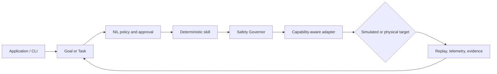

# Buyer evaluation — Inspect the available commands

## Goal

In 15–45 minutes, verify the Product builds or runs as documented and that proprietary notices are present.

## Steps

1. Confirm root `LICENSE` is proprietary and `ACQUISITION.md` exists.
2. Skim `README.md` install/run claims.
3. Execute:

```
```text
┌──────────────────────────────────────────────────────────────────────┐
│  NEXUS CLI  →  GOAL / TASK  →  POLICY + APPROVAL  →  SKILL           │
│       ↓             ↓                 ↓                 ↓             │
│  PROFILE       CAPABILITIES       SAFETY         REPLAY + TELEMETRY   │
│       └────────────────────── NXR-2 SIMULATOR ──────────────────────┘ │
└──────────────────────────────────────────────────────────────────────┘
```

```text
Applications · Studio · Web Console · CLI
                     │
              Nexus Runtime
                     │
  Skills · Tasks · Safety · Identity · Telemetry · Replay
                     │
          Nexus Capability Model (NCM)
                     │
 ROS 2 · LeRobot · Nori layer · Custom HAL · Simulator
                     │
              Simulated or physical robot
```
```powershell
git clone https://github.com/theworker02/Nexus-robotics-OS.git
cd Nexus-robotics-OS
```
```bash
git clone https://github.com/theworker02/Nexus-robotics-OS.git
cd Nexus-robotics-OS
```
```

4. Run tests if present (`npm test`, `pytest`, `cargo test`, `go test ./...`, etc.).
5. Record README vs observed behavior gaps in workpapers.

## Pass criteria

- [ ] Clone succeeds
- [ ] Documented happy path works **or** failure is explained
- [ ] Minimal path needs no surprise secrets
- [ ] License notices intact

*Updated: 2026-09-22*
